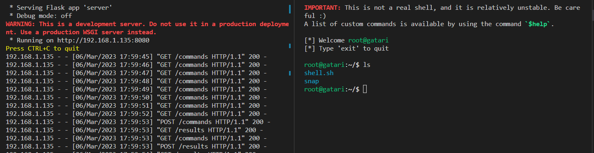
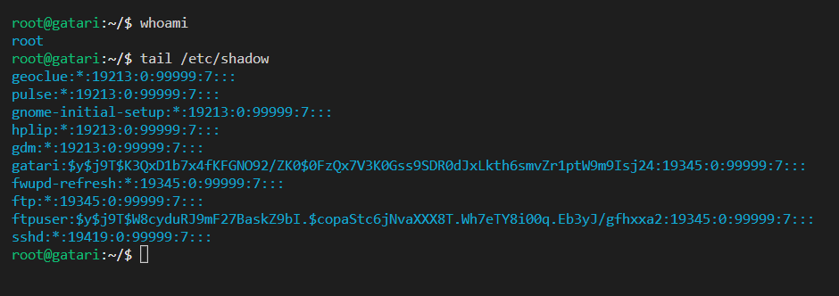

# PyHTTPShell
A python-based reverse shell generator and handler that communicates over HTTP for Command and Control (C2) 

## How it works
C2 communications utilizes HTTP(s) protocols, allowing the operator and agent to connect through a beacon and simulate a shell (well, pseudo-shell).

The C2 communications occur through GET & POST requests to two endpoints, `/commands` and `/results` hosted on the beacon.

- The agent establishes a persistent connection to the `/commands` endpoint, awaiting instructions via GET requests every 1 second.
- The operator can send instructions to the agent using POST requests to the `/commands` endpoint.
- The agent executes the received instructions and POST results to the `/results` endpoint.
- The operator can retrieve the results of the instruction using GET requests to the `/results` endpoint.
- This setup allows for a simulated shell experience, with the `/commands` and `/results` endpoints working together seamlessly to facilitate post-exploitation capabilities.

Tested against **Ubuntu 22.04.2**

## AV Evasion & Notes
PyHTTPShell was not created with the intention of stealthiness, many of it's features will be flagged instantly and the network traffiic generated is essentially identical to a netcat reverse shell. 

Signature-based detection can be evaded by implementing payload encryption or obfuscation techniques, and network traffic should be encrypted with SSL/TLS

## Disclaimer
AV evasion techniques will be added at a later date, but the concept of this POC is not sound for evasive purposes and should not be expected to be used for such.
Post-exploit capabilities as well as custom commands not implemented yet, will be done soon!

It is important to note that this system is terrible for being stealthy, and not meant to be used in actual red-team operations. 

This tool is intended for educational and testing purposes only. You should not use the payloads generated by this tool against hosts without proper authorization and permission.

todo:
- set beacon to callback every 60 seconds instead of 1 second (lol)
- translate reverse shell to a compiled language 
- keylogger (?)
- other post-exploitation capabilities

## Credits
This project take heavy inspiration from [hoaxshell](https://github.com/t3l3machus/hoaxshell), all credit goes to the creators of hoaxshell.

